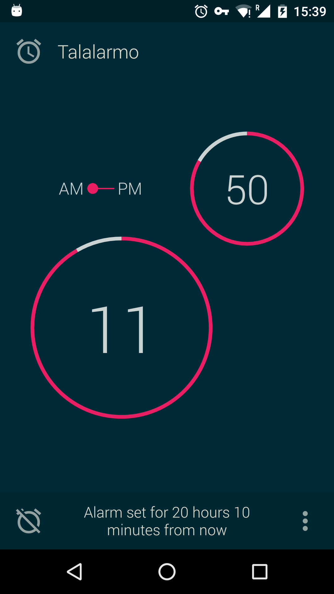

# Talalarmo

 
Minimal, simple and beautiful alarm clock thoughtfully designed by nap enthusiasts.
 
Crafted by a team with over 25 years of sleeping experience - it just has to be the best!
 
 
 
It does only one function but does it well. Only one alarm time is supported and it's recurring daily. Setting the new alarm time takes less than a second. To dismiss the alarm you can touch the screen anywhere which is handy if you are still sleepy and have barely opened your eyes. There is no snooze mode because you should be honest to yourself: if it's time to wake up - go ahead!

## Features

* Clean, minimal and easy-to-use design with modern material UI.
* Set alarm with only two taps - the easiest way to set alarm time.
* Only one alarm time is supported and it's recurring daily. You will never miss it or be disturbed by a wrong alarm.
* Choose alarm music, optionally turn on the vibration
* Wake up easily with gentle alarm (gradually increasing alarm volume)
* Dark and light themes

## Download

* [F-Droid](https://f-droid.org/repository/browse/?fdid=trikita.talalarmo)
* [Google Play](https://play.google.com/store/apps/details?id=trikita.talalarmo)

## Libraries

* [Anvil](https://github.com/zserge/anvil) for reactive UI
* [Jedux](https://github.com/trikita/jedux) for Redux architecture
* [Immutables](https://immutables.github.io) for Redux state builders

## License

Code is distributed under MIT license, feel free to use it. Just please, don't upload Talalarmo clones to Google Play (they are likely to be rejected anyway).

